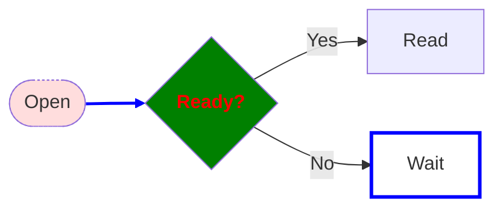
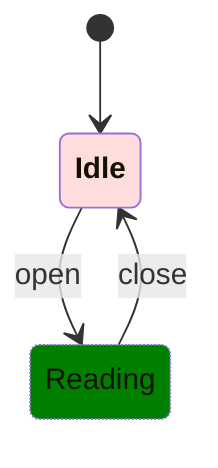
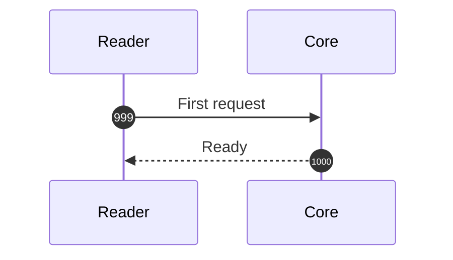

# Diagram styles

## Flow styles

```mermaid
flowchart LR
  A([Open]) --> B{Ready?}
  B -->|Yes| C[Read]
  B -->|No| D[Wait]
  classDef emphasis fill:#008000,color:red,font-weight:bold
  class B emphasis
  style A fill:#ffdddd,stroke-dasharray:2
  style D fill:none,stroke:blue,stroke-width:3
  linkStyle 0 stroke:blue,stroke-width:2.5
```

## State styles

```mermaid
stateDiagram-v2
  [*] --> Idle
  Idle --> Reading: open
  Reading --> Idle: close
  classDef focus fill:#ffdddd,font-weight:bold
  class Idle focus
  style Reading fill:rgb(0 128 0),stroke-dasharray:1 1
```

## Number badges

```mermaid
sequenceDiagram
  autonumber 999
  Reader->>Core: First request
  Core-->>Reader: Ready
```
